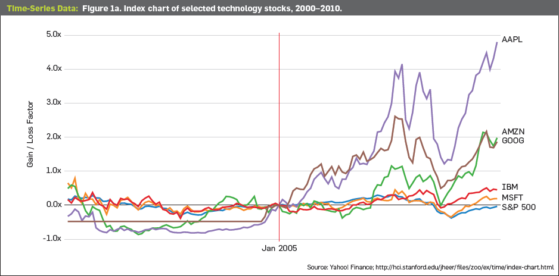
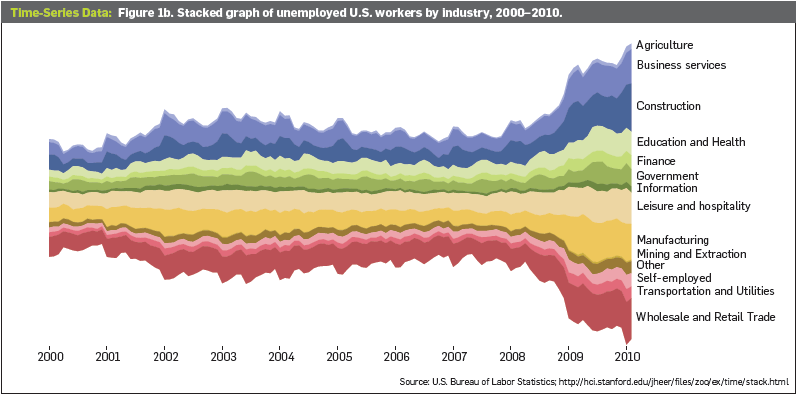
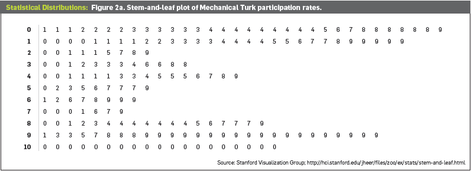
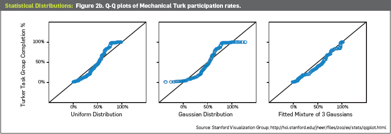
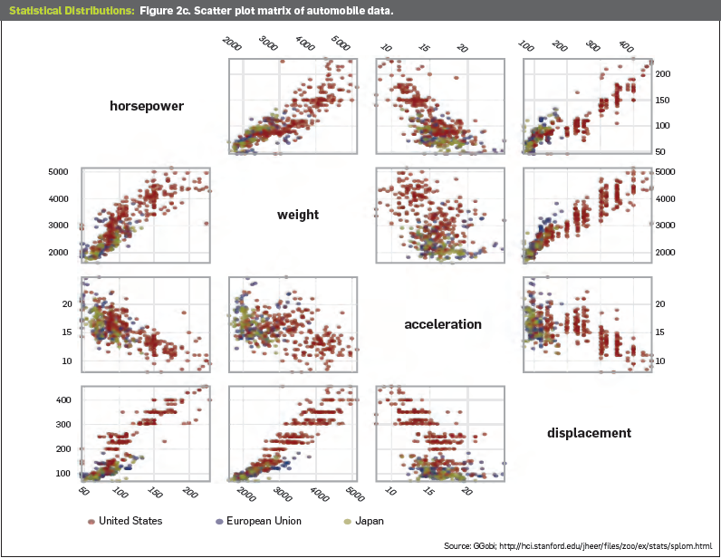
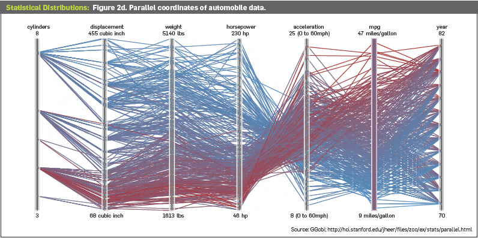
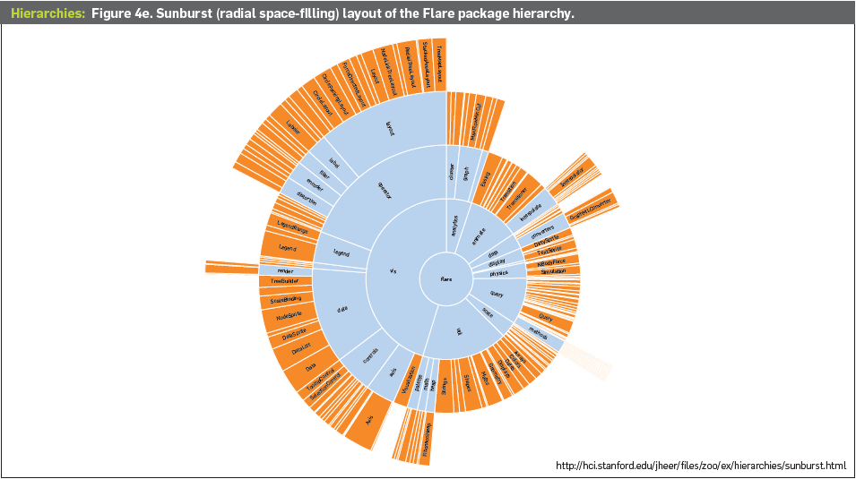
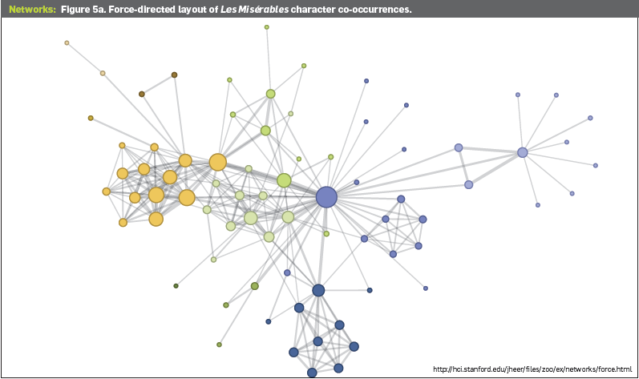
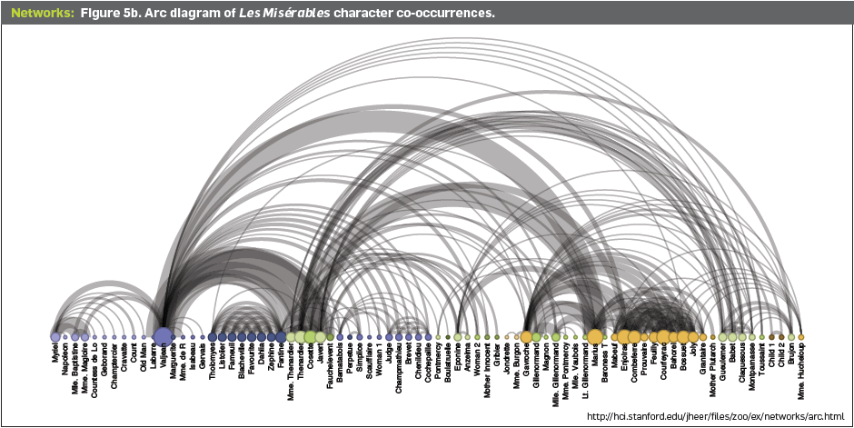
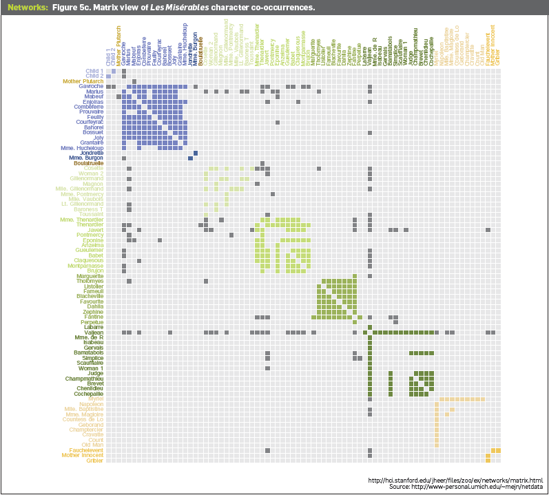

###  大数据时代的可视化与协同创新

*屈华民,  中国美术学院学报*  

- 大数据时代的来临

  > 大数据的四个特点：Volume, Velocity, Variety, Value
  >
  > 不是随机样本，而是所有数据；不是精确性，而是混杂性；不是因果关系，而是相关关系
  >
  > “ 我们比以往的任何时代在更多的事情上变得更加理性，我们更多以数据为依据分析思考问题。 ” 

讨论：什么是数据可视化，数据可视化和平面设计的关系，数据可视化系统的案例

- 可视化在大数据时代的作用

  > “ 刺激视觉神经，调动美学意识 ”
  >
  > 对大数据分析的两种类型：机器算法自动分析；人利用领域知识进行交互式分析→数据可视化系统

- 什么是可视化？

  > 数据➡图形，帮助人们理解大量的和复杂的数据；记录信息，分析推理，证实假设，交流思想
  >
  > 科学可视化；信息可视化；可视分析（数据挖掘）

- 可视化中的美学元素 

  > 1.可视化的“信达雅”
  >
  > ​	信：忠实反映数据信息
  >
  > ​	达：有效帮助用户找到有用信息
  >
  > ​	雅：优美&用户体验
  >
  > 2.可视化中美的含义
  >
  > ​	什么是漂亮的可视化：beauty; novelty; simple and effective
  >
  > ​	能够表达潜在的隐含特征，激励用户深入探索

- 可视化和设计的关系

  > 设计领域的很多原则可以在可视化系统的开发中得到应用

- 基于隐喻的可视化设计 

  >  除信息图[Infographics]外，广泛使用隐喻[Metaphor]来帮助人们理解可视化中图的含意 ——**通感**的可视化设计

- 大数据可视化中的一些研究课题 

  > 数据噪音：将不完整、不精确的数据可视化
  >
  > 众包参与：使用户成为数据分析中的一员，而不仅仅依赖专业分析师
  >
  > 在位分析：对大量动态数据直接分析，而非存入数据库再导入内存
  >
  > 异构数据的可视化：文本、视频、传感数据的可视化

- 工程和艺术的协同创新 

### A Tour through the Visualization Zoo

*Jeffrey Heer, Michael Bostock, Vadim Ogievetsky. Communications of the ACM, 53(6), pp. 59-67, Jun 2010.*  

**demand and aim** of visualization: "to explore, relate, and communicate the data meaningfully"

**methodology** of  creating a visualization: determine which questions to ask, identify the appropriate data, and select effective *visual encodings* to map data values to graphical features. 

**focus** of this article: a few of the more sophisticated and unusual techniques that deal with complex data sets. "zoo"

All visualizations share a common “DNA”—a set of mappings between data properties and visual attributes such as position, size, shape, and color—and customized species of visualization might always be onstructed by varying these encodings.

>  ([Vega](http://vega.github.io/vega), [D3.js](http://d3js.org/), [Protovis](http://protovis.org/), [Prefuse](http://prefuse.org/))  visualization tools developed by Jeffrey and his collaborators 

- Time-Series Data
  
  > one of the most common forms of recorded data. finance, science and public policy
  
  - Index Charts
  
    An interactive line chart that shows percentage changes for a collection of time-series data based on a selected index point. (appropriate to those whose raw values are less important than **relative changes**) [Figure 1a]( https://homes.cs.washington.edu/~jheer//files/zoo/ex/time/index-chart.html )
  
    
  
  - Stacked Graphs / Stream Graphs
  
    Depicts aggregate patterns and often supports drill-down into a subset of individual series. (Do not support negative numbers and is only meaningful for data that coule be rationally summed) [Figure 1b](http://hci.stanford.edu/jheer/files/zoo/ex/time/stack.html) 
    
    
  
  - Small Multiples
  
    Similar to Stacked Graph, but showing each series in its own chart. Not a specific method of drawing, can be constructed for just about any type of visualization. [Figure 1c](http://hci.stanford.edu/jheer/files/zoo/ex/time/multiples.html) 
  
  
  - Horizon Graphs
  
    Increasing the data density of a time-series view while preserving resolution. [Figure 1d](http://hci.stanford.edu/jheer/files/zoo/ex/time/horizon.html) 
  
- Statistical Distributions

  > assess a distribution and exam interactions between multiple dimensions, on behalf of *exploratory data analysis*: gaining insight into how data is distributed to inform data tansformation and modeling decisions.
  
  - Stem-and-Leaf Plots
  
    Alternative to histogram. Uses the data itself to paint a frequency distribution, allowing one to assess both the overall distribution and the contents of each bin. [Figure 2a]( https://homes.cs.washington.edu/~jheer//files/zoo/ex/stats/stem-and-leaf.html ) 
  
    
  
  - Q-Q Plots
  
    *quantile-quantile* plot compares two probability distributions by graphing their quantiles against each other. If the two are similar, the plotted values will lie roughly along the central diagonal. If the two are linearly related, values will again lie along a line. [Figure 2b](https://homes.cs.washington.edu/~jheer//files/zoo/ex/stats/qqplot.html) 
  
    
  
  - SPLOM (Scatter Plot Matrix)
  
    Attempt to represent the relationships among multiple variables. Use small multiples of scatter plots showing a set of pairwise relations among variables. [Figure 2c](http://hci.stanford.edu/jheer/files/zoo/ex/stats/splom.html) 
  
    
  
  - Parallel Coordinates
  
    Repeatedly plot the data on parallel axes and then connect the corresponding points with lines. Each poly-line represents a single row in the database, and line crossings between dimensions often indicate inverse correlation. [Figure 2d]( https://homes.cs.washington.edu/~jheer//files/zoo/ex/stats/parallel.html) 
  
    
  
- Maps

  > Many maps are based on a *cartographic projection*, others knowingly distort or abstract geographic features to tell a richer story or highlight specific data.

  - Flow Maps
  - Choropleth Maps
  - Graduated Symbol Maps
  - Cartograms

- Hierarchies

  > leverage hierarchical structure, allowing rapid multiscale inferences: micro-observations of individual elements and macro-observations of large groups. (Most collection of numbers can be organized into natural hierarchies.) 

  - Node-link Diagrams

    Many different tree-layout algorithms have been designed. *Reingold-Tilford* algorithm produces a tidy result with minimal wasted space [Figure 4a](http://hci.stanford.edu/jheer/files/zoo/ex/hierarchies/tree.html). *Dendrogram(or cluster)* algorithm, using polar rather than Cartesian coordinates, places leaf nodes of the tree at the same level [Figure 4b](http://hci.stanford.edu/jheer/files/zoo/ex/hierarchies/cluster-radial.html). *indented tree* layout, used ubiquitously by operating systems to represent file directories, allow efficient interactive exploration of the tree to find a specific node [Figure 4c](http://hci.stanford.edu/jheer/files/zoo/ex/hierarchies/indent.html). 

  - Adjacency Diagrams

    Space-filling variant of the node-link diagram. Nodes are drawn as solid areas, and their placement relative to adjacent nodes reveals their position in the hierarchy. *Icicle* layout is similar to Reingold-Tilford layout, but can be applied with length/size encoding for more information [Figure 4d](http://hci.stanford.edu/jheer/files/zoo/ex/hierarchies/icicle.html). *Sunburst* layout is equivalent to the icicle layout, but in polar coordinates [Fugire 4e](http://hci.stanford.edu/jheer/files/zoo/ex/hierarchies/sunburst.html).

    

  - Enclosure Diagrams

    Also space filling, using containment rather than adjacency to represent the hierarchy. *Treemap* layout recursively subdivides area into rectangles in different size, using padding to emphasize enclosure [Figure 4f](http://hci.stanford.edu/jheer/files/zoo/ex/hierarchies/treemap.html). *Circle-packing* layout effectively reveals the hierarchy [Figure 4g](http://hci.stanford.edu/jheer/files/zoo/ex/hierarchies/pack.html).

- Networks

  > A central challenge in graph visualization is computing an effective layout. Techniques typically seek to position closely related nodes close and position unrelated nodes far apart in the drawing.

  - Force-directed Layouts
  
    Model the graph as a physical system — nodes are particles that repel each other, and links are springs that pull related nodes together — to determines the node positions. [Figure 5a](http://hci.stanford.edu/jheer/files/zoo/ex/networks/force.html) 
  
    
  
  - Arc Diagrams
  
    Uses a one-dimensional layout of nodes, with circular arcs to represent links. Easy to identify cliques and bridges, and display multivariate data as with indented-tree layout. [Figure 5b](http://hci.stanford.edu/jheer/files/zoo/ex/networks/arc.html) 
  
    
  
  - Matrix Views
  
    "Just show the matrix!". With an effective sorting one quickly can spot clusters and bridges without being disturbed by line crossings. [Figure 5c](http://hci.stanford.edu/jheer/files/zoo/ex/networks/matrix.html) 
  
    

**conslusion**: The DNA underlying all visualizations remains the same: the principled mapping of data variables to visual features such as position, size, shape, and color. Try deconstructing the various visualizations.

### Visualization

*Tamara Munzner. Chapter 27, p 675-707, of Fundamentals of Graphics, Third Edition, by Peter Shirley et al. AK Peters, 2009.*  